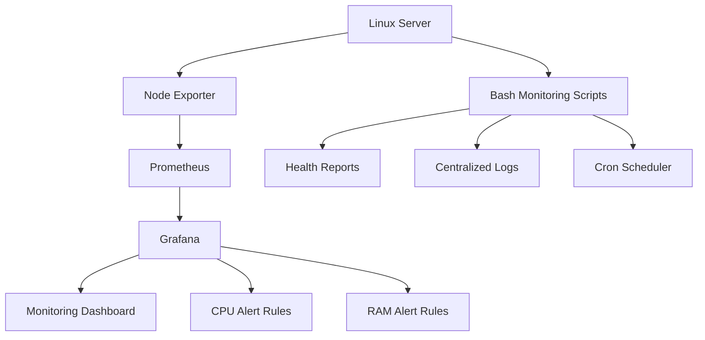

# Linux Server Health Monitor — Architecture

```mermaid
flowchart TD
    A["Linux Server"] --> B["Node Exporter"]
    A --> C["Bash Monitoring Scripts"]

    B --> D["Prometheus"]
    D --> E["Grafana"]

    C --> F["Health Reports"]
    C --> G["Centralized Logs"]
    C --> H["Cron Scheduler"]

    E --> I["Monitoring Dashboard"]
    E --> J["CPU Alert Rules"]
    E --> K["RAM Alert Rules"]
```

